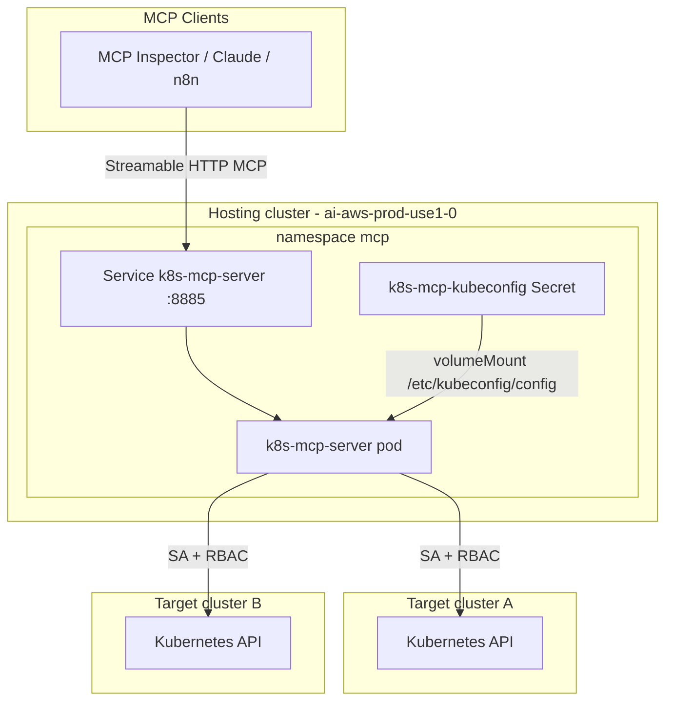
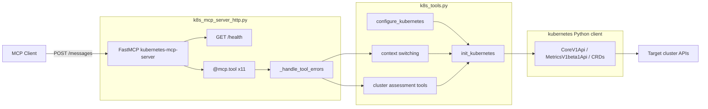
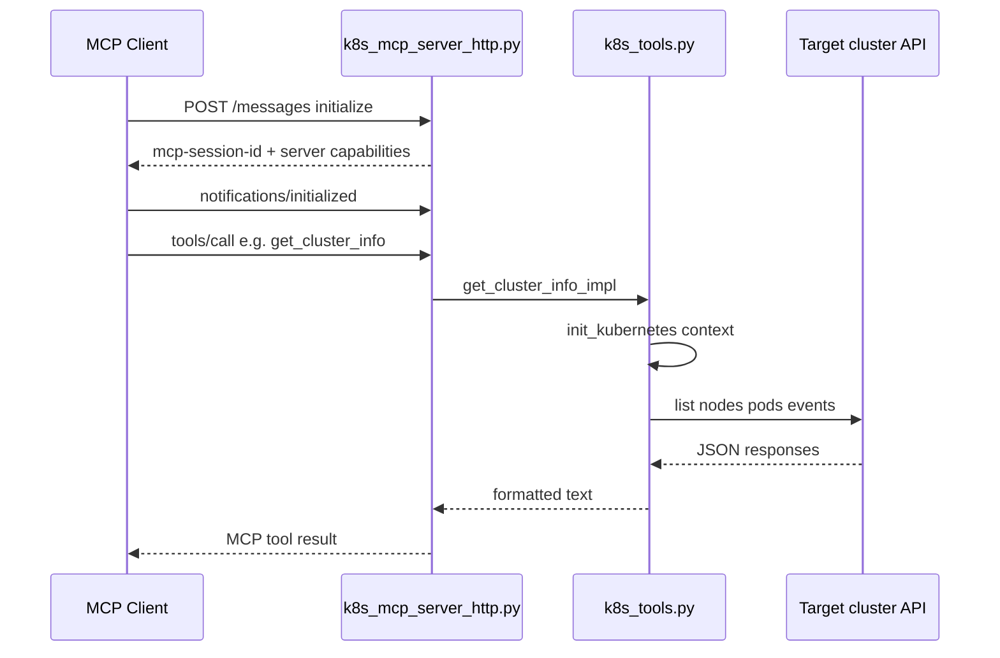

## k8s-mcp Overview

The Kubernetes MCP server is a **read-only assessment service** that exposes cluster health and diagnostics tools to AI clients via the [Model Context Protocol (MCP)](https://modelcontextprotocol.io/). It runs as a pod in a **hosting cluster** and queries **remote target clusters** over the Kubernetes API using a multi-context kubeconfig mounted from a Kubernetes Secret.

**Hosting cluster:** `ai-aws-prod-use1-0`  
**Namespace:** `mcp`  
**Kubeconfig secret:** `k8s-mcp-kubeconfig` (mounted at `/etc/kubeconfig/config`)  
**MCP endpoint:** `http://k8s-mcp-server.mcp.svc.cluster.local:8885/messages`

The k8s mcp server does not mutate clusters — all tools are `get` / `list` only.

The MCP server lives in `ai-aws-prod-use1-0` but does **not** inspect that cluster by default. 
Context management is done via require `k8s-mcp-kubeconfig` secret that contains a multi-context kubeconfig in order to reach **other** Kubernetes clusters over their API endpoints.
In order to enroll new cluster update the `k8s-mcp-kubeconfig` secret. No image rebuild required, just a rollout restart of the `k8s-mcp`.
For each target cluster, the MCP pod in `ai-aws-prod-use1-0` must have **egress** to that cluster's API server.

## Architecture

### Deployment topology



### Code layout



### Request flow



## MCP tools

**Context management**

- `list_kubeconfig_contexts` — available clusters
- `set_kubeconfig_context` — switch active cluster for the session
- `get_kubeconfig_context` — show current cluster

**Cluster assessment (read-only)**

- `get_cluster_info` — Kubernetes API version and nodes (`kubectl get nodes -o wide`)
- `check_node_health`
- `check_pod_health`
- `list_pod_images` — container image strings for a pod or all pods in a namespace
- `get_resource_usage` — requires metrics-server on target
- `diagnose_cluster`
- `get_namespace_summary`
- `check_networking` — Istio / NetworkPolicies (optional CRDs)


* MCP server setup: [Clients SHOULD support stdio whenever possible](https://modelcontextprotocol.io/specification/2025-11-25/basic/transports#streamable-http)

* Two transport modes:
    - STDIO (`k8s_mcp_server_local.py`) — legacy 6-tool variant for local `.mcp.json` integration
    - Streamable HTTP (`k8s_mcp_server_http.py`) — production deployment on port `8885` at `/messages`

## Test the MCP server

* Start the server

```bash
# start server
uv run fastmcp run k8s_mcp_server_http.py --transport http --host 0.0.0.0 --port 8885

# start mcp inspector
uv run fastmcp dev inspector k8s_mcp_server_http.py

# install inspector and run server
npm install -g @modelcontextprotocol/inspector

# Streamable HTTP MCP transport
npx @modelcontextprotocol/inspector --transport http --server-url http://localhost:8885/messages

# port forward the mcp-k8s servers
kubectl -n mcp port-forward svc/mcp-k8s 8885:8885

# port forward the agent-gateway
kubectl port-forward -n agentgateway svc/agentgateway-ui 15000:80
```

* Build image

```bash

docker build  --no-cache --platform linux/amd64,linux/arm64 -t dejanualex/k8s-mcp-server:2.1 .
docker push dejanualex/k8s-mcp-server:2.0

# user ECR
docker build --no-cache --platform linux/amd64,linux/arm64 -t 209202477790.dkr.ecr.us-east-1.amazonaws.com/alchemy-docker/k8s-mcp-server:2.1 .
docker push  209202477790.dkr.ecr.us-east-1.amazonaws.com/alchemy-docker/k8s-mcp-server:2.1
```

### Prompt examples 

```
Which Kubernetes clusters can you reach?
Check cluster info
Are there any issues in the cluster
Are there any failing or pending pods?
```
