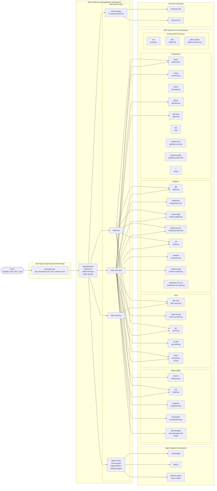

```mermaid
graph LR
    Client(["Client\n(Claude Code / n8n / curl)"])

    subgraph Istio["Istio Ingress (ingress-gw-private-warp)"]
        VS["agentgateway-api.computev2.use1.aws.i.alchemy.com"]
    end

    subgraph AgentGateway["Agent Gateway (agentgateway namespace)"]
        GW["agentgateway\n:3000 MCP\n:4000 Anthropic\n:4001 OpenAI"]

        subgraph Routes["Path-prefix routes"]
            R_LLM["/v1/messages\n/v1/chat/completions"]
            R_ALL["/mcp  (all-mcps)"]
            R_CPE["/cpe/mcp"]
            R_K8S["/k8s-mcp/mcp"]
            R_AGENTS["Agent routes\n/oncall-agent\n/agents/daikon\n/capacity-agent"]
        end
    end

    subgraph LLM["LLM APIs (external)"]
        Anthropic["Anthropic API"]
        OpenAI["OpenAI API"]
    end

    subgraph Agents["Agents (agents namespace)"]
        OncallAgent["oncall-agent"]
        DaikonAgent["daikon"]
        CapacityAgent["capacity-agent\n(local :3024)"]
    end

    subgraph K8s_MCPs["MCP Servers (mcp namespace)"]
        direction TB
        subgraph Observability
            Thanos["thanos\n/thanos/mcp"]
            Loki["loki\n/loki/mcp"]
            Langfuse["langfuse\n/langfuse/mcp"]
            Cloudwatch["cloudwatch\n/cloudwatch/mcp"]
            Alertmanager["alertmanager\n/alertmanager/mcp\n(local)"]
        end
        subgraph Infra
            K8s["k8s-mcp\n/k8s-mcp/mcp"]
            NodeCentral["node-central\n/node-central/mcp"]
            RPC["rpc\n/rpc/mcp"]
            RPCDiff["rpc-diff\n/rpc-diff/mcp"]
            Druid["druid\n/druid/mcp\n(local)"]
        end
        subgraph Platform
            DBT["dbt\n/dbt/mcp"]
            Pagerduty["pagerduty\n/pagerduty/mcp"]
            StatusPage["status-page\n/status-page/mcp"]
            Billing["billing-service\n/billing-service/mcp"]
            Orb["orb\n/orb/mcp"]
            Capacity["capacity\n/capacity/mcp"]
            MethodAudit["method-audit\n/method-audit/mcp"]
            Webhooks["webhooks-service\n/webhooks-service/mcp"]
        end
        subgraph Productivity
            Pylon["pylon\n/pylon/mcp"]
            Notion["notion\n/notion/mcp"]
            Asana["asana\n/asana/mcp"]
            Github["github\n/github/mcp"]
            N8nSafe["n8n-safe\n/n8n/mcp"]
            N8n["n8n\n/n8n"]
            Grafana["grafana-oss\n/grafana-oss/mcp"]
            GrafanaPublic["grafana-public\n/grafana-public/mcp"]
            X["x\n/x/mcp"]
        end
        subgraph External_MCPs["External MCP (remote)"]
            Exa["exa\n/exa/mcp"]
            Bitly["bitly\n/bitly/mcp"]
            GithubNative["github-native\n/github-native/mcp"]
        end
    end

    Client --> VS
    VS --> GW
    GW --> R_LLM & R_ALL & R_CPE & R_K8S & R_AGENTS
    R_LLM --> Anthropic & OpenAI
    R_AGENTS --> OncallAgent & DaikonAgent & CapacityAgent

    R_K8S --> K8s

    R_ALL --> Thanos & Loki & Langfuse & Cloudwatch & Alertmanager
    R_ALL --> K8s & NodeCentral & RPC & RPCDiff & Druid
    R_ALL --> DBT & Pagerduty & StatusPage & Billing & Orb & Capacity & MethodAudit
    R_ALL --> Pylon & Notion & Github & N8nSafe

    R_CPE --> Pylon & Druid & Orb & Billing & DBT & RPC & Loki & StatusPage
```
